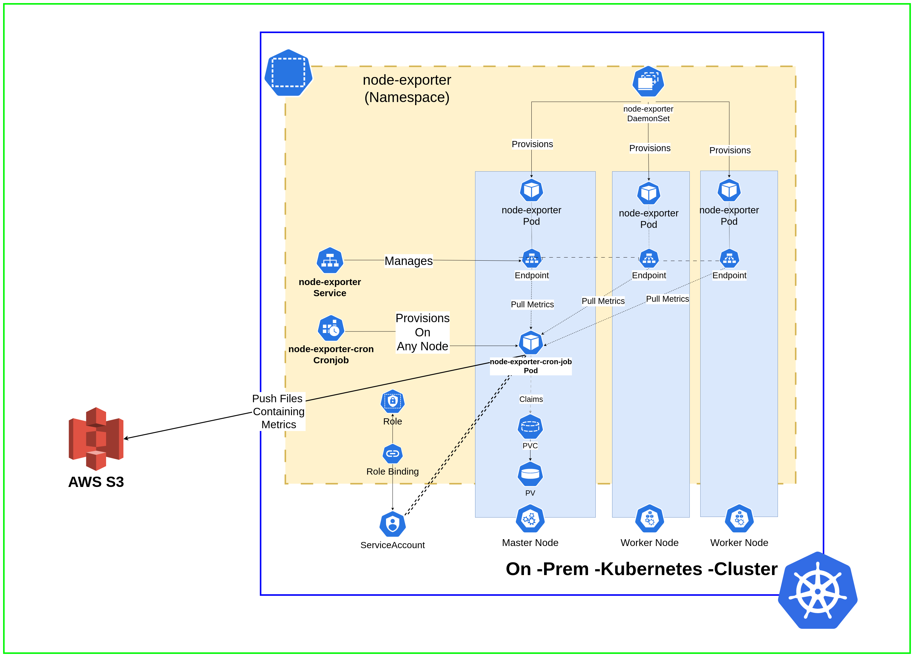

# Node-Exporter Metrics Collector

This is a set of simple Kubernetes manifests the deploy node-exporter on each node and collects logs into a persistent volume and also uploads to S3.

**Tested On**
- k3d

## Problem Statement

**Create a Kubernetes cron job that pulls node metrics like (CPU, Memory, Disk usage) and stores them in a file.**

- Every time the cron runs, it should create a new file.
- The filename should have the current timestamp.
- By default, cron should be minute, but it should be configurable with the slightest changes to code.
- Choose a tool of your choice to collect and expose metrics. Preferable is node exporter.
- The instances involved here are Kubernetes nodes themselves.

**Expected Output:**

- The actual program code pulls the metrics and writes them to a file.
- The Dockerfile to containerize the code.
- Kubernetes YAML or HELM Chart.
- A README file explaining the design, deployment and other details.

**Note :**
- Pick the choice of your language to write the cron job. Preferable is bash.
- Treat the output files generated as essential and should be retained on pod restarts.
- Deployment can either be Kube yamls, helm charts, kustomize.
- You can make necessary assumptions if required and document them.
- Choose local kubernetes setup like minikube, kind. Other option is to pick any cloud platform's kubernetes flavour.

## Video Demonstration
[](https://www.youtube.com/watch?v=NPzEO7Yw5ho)  
**Link** - [https://www.youtube.com/watch?v=NPzEO7Yw5ho](https://www.youtube.com/watch?v=NPzEO7Yw5ho)


## Architecture
---

The below diagram shows the Architecture of the Logs Collector.



## Installation
---
### Step -1 Install Prometheus Operator
This will install the **prometheus-operator** which is required to run the node-exporter.
It does not include Prometheus, Grafana etc.  


```
git clone https://github.com/harsh098/node-exporter-cron-job
cd k8s/manifests/node-exporter
helm upgrade --install prometheus-operator prometheus-community/kube-prometheus-stack --namespace node-exporter --values operator-values.yml --create-namespace
```  
It installs the following crds:-  
```
$ kubectl get crds | grep monitoring.coreos.com 
alertmanagerconfigs.monitoring.coreos.com        2024-05-07T11:49:39Z
alertmanagers.monitoring.coreos.com              2024-05-07T11:49:40Z
podmonitors.monitoring.coreos.com                2024-05-07T11:49:40Z
probes.monitoring.coreos.com                     2024-05-07T11:49:40Z
prometheusagents.monitoring.coreos.com           2024-05-07T11:49:40Z
prometheuses.monitoring.coreos.com               2024-05-07T11:49:40Z
prometheusrules.monitoring.coreos.com            2024-05-07T11:49:40Z
scrapeconfigs.monitoring.coreos.com              2024-05-07T11:49:40Z
servicemonitors.monitoring.coreos.com            2024-05-07T11:49:40Z
thanosrulers.monitoring.coreos.com               2024-05-07T11:49:41Z
```  


### Step -2 Create an S3 Bucket and an IAM User with necessary Permission to Access Bucket also Configure Access Keys

### Step -3 Install Node Exporter
Now we will install the DaemonSet, Service and ServiceMonitor for our **node-exporter**  

|**Component**|**Purpose**|
|---|---|
|_DaemonSet_|Deploys a node-exporter Pod in each namespace|
|_Service_|We will utilise this service to scrape the endpoints for collecting metrics from **node-exporter** pods|
|_Service Monitor_|This can be utilised in future to deploy with Prometheus.|

```
kubectl apply -f daemonset.yml  service.yml servicemonitor.yml
```

Following Pods can be seen in the `node-exporter` namespace  

```
$ kubectl get po -n node-exporter
NAME                                                   READY   STATUS    RESTARTS       AGE
node-exporter-ssmnh                                    1/1     Running   3 (179m ago)   30h
node-exporter-rtjvz                                    1/1     Running   3 (179m ago)   30h
node-exporter-cfglb                                    1/1     Running   3 (179m ago)   30h
prometheus-operator-kube-p-operator-78b5f48bfd-zm88h   1/1     Running   3 (179m ago)   32h
```

### Step -4 Configure S3 Secrets

Now navigate to `k8s/manifests/app/secret-spec.yml` and configure the secrets as instructed in the file.
> Note:- This is generally not a good practice to set up secrets this way. Consider External Secrets or a Secrets Manager such as HashiCorp Vault in production

### Step -5 Deploy the CronJob

```
cd k8s/manifests/app
kubectl apply -f .
```

This will start the CronJob scheduled at every 5 minutes `*/5 * * *` that scrapes the node metrics at each node and uploads to S3 also it saves it into a Persistent Volume in the Cluster

We can see the CronJobs using this command  

```
$ kubectl get cronjobs -n node-exporter
NAME                 SCHEDULE      SUSPEND   ACTIVE   LAST SCHEDULE   AGE
node-exporter-cron   */5 * * * *   False     0        115s            27m
```

## Accessing the Logs inside the PersistentVolume

This example was using the `rancher.io/local-path` storage class on the k3d you may need to edit the `k8s/manifests/app/pvc.yml`

Execute the following commands to get the name of the Node where the pvc is deployed

```
$ kubectl get pvc -n node-exporter
NAME                     STATUS    VOLUME   CAPACITY   ACCESS MODES   STORAGECLASS   AGE
node-exporter-cron-pvc   Pending                                     local-path     2s
```

Get Node name and location of the PVC using the following commands

```
$ kubectl get pvc -n node-exporter
NAME                     STATUS   VOLUME                                     CAPACITY   ACCESS MODES   STORAGECLASS   AGE
node-exporter-cron-pvc   Bound    pvc-9f6288f3-75d2-4c4b-b39a-28d823ac2252   1Gi        RWO            local-path     10m
  ...
```

Determine the PersistentVolume  

```
$ kubectl get pv
NAME                                       CAPACITY   ACCESS MODES   RECLAIM POLICY   STATUS   CLAIM                                  STORAGECLASS            REASON   AGE
pvc-9f6288f3-75d2-4c4b-b39a-28d823ac2252   1Gi        RWO            Delete           Bound    node-exporter/node-exporter-cron-pvc   local-path
```

Get Node Name and Path where the volume is deployed

```
$ kubectl describe pv pvc-9f6288f3-75d2-4c4b-b39a-28d823ac2252 
Name:              pvc-9f6288f3-75d2-4c4b-b39a-28d823ac2252
Labels:            <none>
Annotations:       local.path.provisioner/selected-node: k3d-multicluster-server-0
                   pv.kubernetes.io/provisioned-by: rancher.io/local-path
Finalizers:        [kubernetes.io/pv-protection]
StorageClass:      local-path
Status:            Bound
Claim:             node-exporter/node-exporter-cron-pvc
Reclaim Policy:    Delete
Access Modes:      RWO
VolumeMode:        Filesystem
Capacity:          1Gi
Node Affinity:     
  Required Terms:  
    Term 0:        kubernetes.io/hostname in [k3d-multicluster-server-0]
Message:           
Source:
    Type:          HostPath (bare host directory volume)
    Path:          /var/lib/rancher/k3s/storage/pvc-9f6288f3-75d2-4c4b-b39a-28d823ac2252_node-exporter_node-exporter-cron-pvc
    HostPathType:  DirectoryOrCreate
Events:            <none>

```

SSH into the node (in my case k3d node was a docker container so I had to do a `docker exec`).

**Inside the Container**
```
/ # cd /var/lib/rancher/k3s/storage/
/var/lib/rancher/k3s/storage # ls
pvc-9f6288f3-75d2-4c4b-b39a-28d823ac2252_node-exporter_node-exporter-cron-pvc
/var/lib/rancher/k3s/storage # cd pvc-9f6288f3-75d2-4c4b-b39a-28d823ac2252_node-exporter_node-exporter-cron-pvc/
/var/lib/rancher/k3s/storage/pvc-9f6288f3-75d2-4c4b-b39a-28d823ac2252_node-exporter_node-exporter-cron-pvc # ls
k3d-multicluster-agent-0-20240508-201015.log  k3d-multicluster-agent-1-20240508-202012.log
k3d-multicluster-agent-0-20240508-201507.log  k3d-multicluster-agent-1-20240508-202506.log
k3d-multicluster-agent-0-20240508-202012.log  k3d-multicluster-server-0-20240508-201015.log
k3d-multicluster-agent-0-20240508-202505.log  k3d-multicluster-server-0-20240508-201507.log
k3d-multicluster-agent-1-20240508-201015.log  k3d-multicluster-server-0-20240508-202012.log
k3d-multicluster-agent-1-20240508-201507.log  k3d-multicluster-server-0-20240508-202505.log
```

  
**Getting output of one of the logs**

```
cat k3d-multicluster-agent-0-20240508-201015.log | less 
```

**Output:-**


## Viewing Logs in S3 Console
---

Same logs can be viewed inside the S3 Console


## Security Measures Taken
---

1. Hardened Docker Image:- defauts to non-root user
2. Uses ServiceAccount with pods which only allow readonly access to Service Endpoints for node-exporter


## Issues with this design
---
**This design suffers from following issues:-**
1. The PVs are bound to a single node once provisioned which stores logs for all nodes.
2. This means if data in the node containing the PV is destroyed the PVs are also lost.
3. With EKS prefer using EBS/EFS CSI Driver which can be used to provision EBS/EFS Volumes which can be mounted to other EC2 Instances and logs can be accessed using EFS mounts for EFS volumes and for EBS prefer using multi-attach with EC2 Instances to access logs.
4. Similarly with GKE, prefer using GCE PersistentDisk CSI Driver.
5. On, on-prem K8s, prefer using NFS Mounts.
6. Another option for HA, is to use Distributed Storage CSI Drivers such as those provided with openEBS and longhorn.
